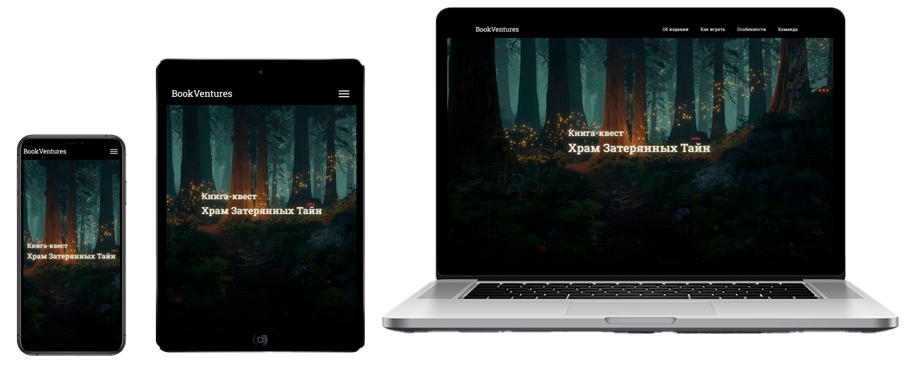

# 🌄 Quest-Book WEB — лендинг по книге-квесту «Храм затерянных тайн»

[](https://github.com/Bit-Maximum/Quest-Book-WEB/blob/master/README.md)
[](https://github.com/Bit-Maximum/Quest-Book-WEB/blob/master/translation/README.ru.md)


> _Этот сайт-лендинг был создан мной в 2023 году как **визуальное и атмосферное дополнение** к книге-квесту *«Храм затерянных тайн»*._



## 🗺 О проекте

Несмотря на небольшую структуру, я стремился сделать лендинг максимально выразительным и интересным: с антуражем древней цивилизации, интерактивными элементами и адаптивной вёрсткой.

Проект состоит из **двух страниц**:
- Главная страница (лендинг)
- Демо-фрагмент книги с интерактивом

## 🚀 Запуск проекта

Проект можно открыть с помощью Docker или локально:

### 🐳 Запуск в Docker

Если у вас установлен [Docker](https://www.docker.com/), вы можете запустить проект в контейнере:
   ```bash
   docker run -d -p 8080:80 bitmaximum/quest-book-web:latest
   ```
Сайт будет доступен по адресу: `http://localhost:8080`

### (Альтернативно) Запуск локально:

1. Склонировать репозиторий:
   ```bash
   git clone https://github.com/Bit-Maximum/Quest-Book-WEB
   ```

2. Открыть `index.html` в браузере.
>❗ Не требует установки или сборки. Все файлы — статические.


## 📸 Галерея

https://github.com/user-attachments/assets/c306cb01-706d-4dae-9cfe-bb02954138be

https://github.com/user-attachments/assets/c3b4a8df-1112-4ada-9ee3-640e4ae273c2

## 📱 Адаптивность

Сайт оптимизирован как для настольных, так и для мобильных устройств. Использованы гибкие сетки и медиа-запросы для комфортного чтения на разных экранах.

## 💡 Цели проекта

- Получить **первый опыт** в веб-разработке
- Сделать **визуальное сопровождение** к проекту с книгой-квестом
- Освоить работу с HTML, CSS, JavaScript и jQuery
- Попрактиковаться в **адаптивной вёрстке** под разные устройства

## ⚙️ Используемые технологии
- 📄 HTML5
- 🎨 CSS3
- ⚙️ JavaScript (vanilla + jQuery)
